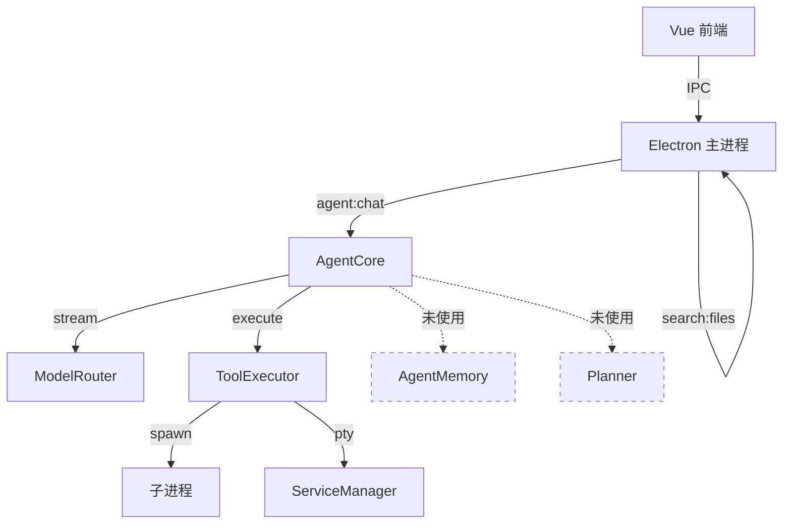
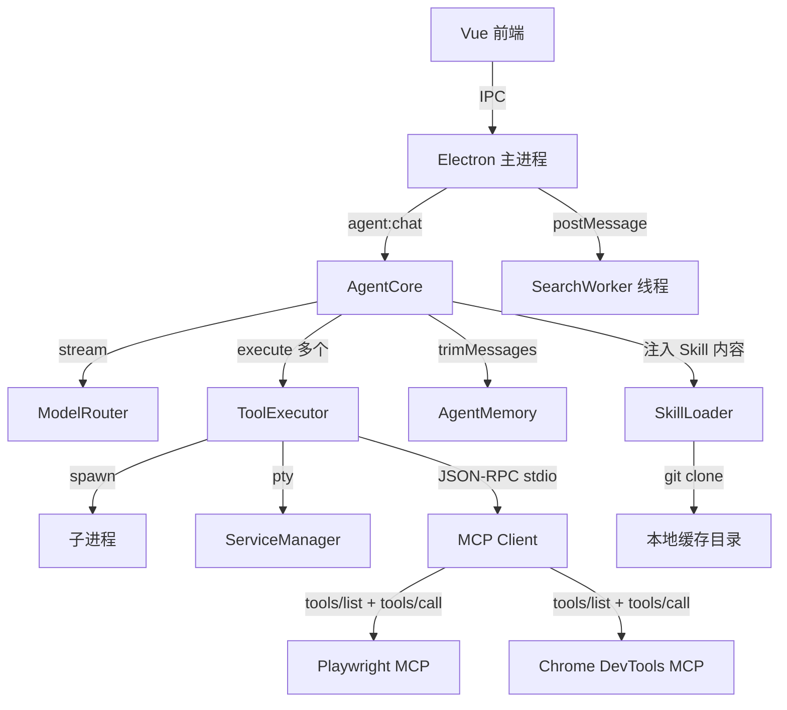

# 设计文档：Agent 系统级优化

## 概述

本设计文档描述 Pantheon Forge 编辑器 Agent 系统的全面优化方案。当前系统存在三大核心问题：

1. **Skills/MCP/Rules 系统空壳化**：`settings.ts` 定义了 9 个内置 Skills 和 2 个 MCP 服务器，但 `buildSystemPrompt()` 仅将名称/URL 写入 system prompt，没有实际克隆仓库、读取内容、启动 MCP 服务器或发现工具的代码。
2. **工具能力不足**：`search_files` 只返回文件名不返回匹配行内容；`read_file` 截断在 10000 字符且无行号；缺少 diff/patch 工具导致每次修改都需要覆写整个文件。
3. **系统性能瓶颈**：`AgentMemory` 已实现但从未集成到 ReAct 循环；每轮只处理一个 tool_call；`search:files` IPC 在主进程做递归文件遍历阻塞事件循环。

优化目标是让这三个领域真正落地可用，使 Agent 具备完整的 Skills 内容注入、MCP 协议工具调用、增强的文件操作工具、上下文窗口管理和并行工具执行能力。

## 架构

### 当前架构



### 优化后架构



### 关键设计决策

| 决策 | 选择 | 理由 |
|------|------|------|
| MCP 传输方式 | stdio (stdin/stdout JSON-RPC) | MCP 规范推荐的本地服务器传输方式，与 npx 启动方式兼容 |
| Skill 缓存位置 | `app.getPath('userData')/skills-cache/` | Electron 标准用户数据目录，跨平台兼容 |
| 搜索 Worker | Node.js `worker_threads` | 项目已有 `git-worker.ts` 先例，模式一致 |
| diff/patch 策略 | 文本片段查找替换 | 比 unified diff 更简单可靠，模型更容易生成正确的旧/新文本对 |
| 并行工具调用 | `Promise.all` | OpenAI API 原生支持多 tool_call，只需在执行侧并行化 |
| token 估算 | 字符数 / 3（中英混合） | 沿用 `memory.ts` 现有策略，足够粗略估算 |


## 组件与接口

### 1. SkillLoader（新增：`agent/skill-loader.ts`）

负责从 Git 仓库克隆 Skill 并读取内容文件。

```typescript
interface SkillContent {
  name: string
  content: string       // 实际的 skill 指导文本
  source: string        // 来源仓库 URL
  loadedAt: number      // 加载时间戳
}

class SkillLoader {
  private cacheDir: string  // app.getPath('userData') + '/skills-cache'

  constructor(cacheDir: string)

  /**
   * 加载单个 Skill：检查缓存 → 克隆/更新仓库 → 读取内容文件
   * 返回 Skill 内容文本，失败时返回 null 并记录日志
   */
  async loadSkill(skill: SkillItem): Promise<SkillContent | null>

  /**
   * 批量加载所有已启用的 Skills
   * 跳过加载失败的 Skill，不影响其余
   */
  async loadAllSkills(skills: SkillItem[]): Promise<SkillContent[]>

  /**
   * 检查本地缓存是否存在该 Skill 仓库
   */
  private isCloned(repoUrl: string): boolean

  /**
   * 克隆仓库到缓存目录
   * 目录命名：将 repo URL hash 为目录名
   */
  private async cloneRepo(repoUrl: string): Promise<string>

  /**
   * 读取 Skill 内容文件
   * 查找顺序：skill 字段指定的文件 → README.md → 第一个 .md 文件
   */
  private async readSkillContent(repoDir: string, skillName: string): Promise<string>
}
```

**克隆策略**：
- 使用 `git clone --depth 1` 浅克隆，减少下载量
- 缓存目录结构：`skills-cache/{url-hash}/{repo-name}/`
- 克隆通过 `child_process.spawn('git', ...)` 执行
- 失败时记录 `console.error` 并返回 null，不中断其他 Skill 加载

### 2. MCPClient（新增：`agent/mcp-client.ts`）

实现 MCP 协议客户端，通过 stdio 与 MCP 服务器通信。

```typescript
interface MCPTool {
  name: string
  description: string
  inputSchema: Record<string, any>  // JSON Schema
}

interface MCPServerConnection {
  name: string
  process: ChildProcess
  tools: MCPTool[]
  status: 'connecting' | 'ready' | 'error' | 'closed'
}

class MCPClient {
  private connections: Map<string, MCPServerConnection>

  constructor()

  /**
   * 启动 MCP 服务器并建立连接
   * 1. spawn 进程（command + args）
   * 2. 发送 initialize 请求
   * 3. 调用 tools/list 发现工具
   */
  async connect(server: McpServerItem): Promise<MCPTool[]>

  /**
   * 连接所有已启用的 MCP 服务器
   * 单个失败不影响其余
   */
  async connectAll(servers: McpServerItem[]): Promise<void>

  /**
   * 获取所有已连接服务器的工具定义
   * 转换为 ToolDefinition 格式供模型使用
   * 工具名添加 mcp_ 前缀避免与内置工具冲突
   */
  getAllToolDefinitions(): ToolDefinition[]

  /**
   * 调用 MCP 工具
   * 通过 JSON-RPC tools/call 转发到对应服务器
   */
  async callTool(toolName: string, args: Record<string, any>): Promise<string>

  /**
   * 关闭所有连接和进程
   */
  async shutdown(): Promise<void>

  /**
   * 发送 JSON-RPC 请求并等待响应
   */
  private async sendRequest(
    conn: MCPServerConnection,
    method: string,
    params?: any
  ): Promise<any>
}
```

**JSON-RPC 通信协议**：
```
→ {"jsonrpc":"2.0","id":1,"method":"initialize","params":{"protocolVersion":"2024-11-05","capabilities":{},"clientInfo":{"name":"pantheon-forge","version":"1.0.0"}}}
← {"jsonrpc":"2.0","id":1,"result":{"protocolVersion":"2024-11-05","capabilities":{"tools":{}},"serverInfo":{...}}}
→ {"jsonrpc":"2.0","id":2,"method":"tools/list"}
← {"jsonrpc":"2.0","id":2,"result":{"tools":[{"name":"browser_navigate","description":"...","inputSchema":{...}}]}}
→ {"jsonrpc":"2.0","id":3,"method":"tools/call","params":{"name":"browser_navigate","arguments":{"url":"..."}}}
← {"jsonrpc":"2.0","id":3,"result":{"content":[{"type":"text","text":"..."}]}}
```

**工具名映射**：MCP 工具在传给模型时添加 `mcp_{serverName}_` 前缀（如 `mcp_playwright_browser_navigate`），调用时去除前缀还原为原始工具名。

### 3. AgentCore 改造（修改：`agent/agent-core.ts`）

```typescript
// 新增：ReAct 循环中的关键变更

class AgentCore {
  private memory: AgentMemory          // 集成上下文管理
  private skillLoader: SkillLoader     // 集成 Skill 加载
  private mcpClient: MCPClient         // 集成 MCP 客户端

  async *run(...) {
    // 1. 加载 Skills 内容（首次或配置变更时）
    // 2. 连接 MCP 服务器（首次或配置变更时）
    // 3. 构建 system prompt（注入 Skill 实际内容 + 规则）
    // 4. 合并工具列表（内置工具 + MCP 工具）
    // 5. ReAct 循环：
    //    a. memory.trimMessages() 裁剪上下文
    //    b. 调用模型
    //    c. 收集所有 tool_calls（支持多个）
    //    d. Promise.all 并行执行
    //    e. 批量回传结果
  }
}
```

### 4. ToolExecutor 增强（修改：`agent/tool-executor.ts`）

```typescript
// 新增/修改的工具

class ToolExecutor {
  // 增强 read_file：添加行号，支持行范围
  private async readFile(path: string, startLine?: number, endLine?: number): Promise<string>

  // 增强 search_files：返回行号+内容+上下文，支持正则
  private async searchFiles(query: string, pattern?: string, isRegex?: boolean): Promise<string>

  // 新增 edit_file：文本片段查找替换
  private async editFile(path: string, oldStr: string, newStr: string): Promise<string>
}
```

### 5. SearchWorker（新增：`electron/search-worker.ts`）

将文件搜索操作移到 Worker 线程，避免阻塞主进程。

```typescript
// 遵循 git-worker.ts 的模式
interface SearchRequest {
  id: string
  type: 'agent-search' | 'ipc-search'
  cwd: string
  query: string
  options: {
    pattern?: string
    isRegex?: boolean
    caseSensitive?: boolean
    wholeWord?: boolean
    includePattern?: string
    excludePattern?: string
    maxResults?: number
    contextLines?: number
  }
}

interface SearchMatch {
  file: string
  line: number
  col: number
  text: string
  matchText: string
  context?: string[]  // 上下文行
}

interface SearchResult {
  id: string
  matches: { file: string; relPath: string; matches: SearchMatch[] }[]
  truncated: boolean
  totalMatches: number
}
```

### 6. buildSystemPrompt 改造

```typescript
function buildSystemPrompt(config?: AgentConfig, skillContents?: SkillContent[]): string {
  let prompt = BASE_SYSTEM_PROMPT

  // Rules：结构化格式，带编号和遵守指令
  if (config?.rules?.length) {
    prompt += '\n\n## 工作规则（必须严格遵守）\n'
    prompt += '以下规则是用户设定的强制要求，你必须在每次操作中遵守：\n'
    config.rules.forEach((r, i) => {
      prompt += `规则 ${i + 1}: ${r}\n`
    })
  }

  // Skills：注入实际内容而非仅名称
  if (skillContents?.length) {
    prompt += '\n\n## Skills 编程指导\n'
    prompt += '以下是已加载的编程技能指导，请在相关场景中遵循：\n'
    skillContents.forEach(s => {
      prompt += `\n### ${s.name}\n${s.content}\n`
    })
  }

  // edit_file 工具使用指导
  prompt += '\n\n## 文件修改策略\n'
  prompt += '- 局部修改：优先使用 edit_file 工具，提供要替换的旧文本和新文本\n'
  prompt += '- 创建新文件或大范围重写：使用 write_file 工具\n'

  return prompt
}
```


## 数据模型

### SkillItem（已有，`settings.ts`）

```typescript
interface SkillItem {
  name: string       // 显示名称，如 "Web Design Guidelines"
  repo: string       // Git 仓库 URL
  skill: string      // Skill 标识符，用于定位内容文件
  enabled: boolean   // 是否启用
}
```

### SkillContent（新增）

```typescript
interface SkillContent {
  name: string       // 来自 SkillItem.name
  content: string    // 从仓库读取的实际 Skill 文本内容
  source: string     // 来源仓库 URL
  loadedAt: number   // 加载时间戳（用于缓存过期判断）
}
```

### McpServerItem（已有，`settings.ts`）

```typescript
interface McpServerItem {
  name: string                    // 服务器名称
  command: string                 // 启动命令（如 "npx"）
  args: string[]                  // 命令参数
  env?: Record<string, string>    // 环境变量
  enabled: boolean                // 是否启用
}
```

### MCPServerConnection（新增）

```typescript
interface MCPServerConnection {
  name: string                    // 服务器名称
  process: ChildProcess           // 服务器子进程
  tools: MCPTool[]                // 发现的工具列表
  status: 'connecting' | 'ready' | 'error' | 'closed'
  requestId: number               // JSON-RPC 请求 ID 计数器
  pendingRequests: Map<number, {  // 等待响应的请求
    resolve: (value: any) => void
    reject: (reason: any) => void
    timeout: NodeJS.Timeout
  }>
}
```

### MCPTool（新增）

```typescript
interface MCPTool {
  name: string                    // 原始工具名
  description: string             // 工具描述
  inputSchema: Record<string, any>  // JSON Schema 参数定义
  serverName: string              // 所属 MCP 服务器名称
}
```

### AgentConfig（修改）

```typescript
interface AgentConfig {
  skills: SkillItem[]
  mcpServers: McpServerItem[]
  rules: string[]
  // 新增
  maxContextTokens?: number       // 模型上下文窗口大小（token）
}
```

### Message（已有，`base-adapter.ts`，无需修改）

```typescript
interface Message {
  role: 'system' | 'user' | 'assistant' | 'tool'
  content: string
  tool_call_id?: string
  tool_calls?: {
    id: string
    type: 'function'
    function: { name: string; arguments: string }
  }[]
}
```

现有 Message 接口已支持多 tool_calls，无需修改。AgentCore 的 ReAct 循环需要改为收集数组而非单个 pendingToolCall。

### SearchRequest / SearchResult（新增，Worker 通信）

```typescript
interface SearchRequest {
  id: string
  cwd: string
  query: string
  isRegex: boolean
  caseSensitive: boolean
  pattern?: string          // 文件名匹配模式
  maxResults: number        // 默认 50
  contextLines: number      // 默认 2
}

interface SearchMatchItem {
  file: string
  relPath: string
  matches: {
    line: number
    col: number
    text: string
    matchText: string
    contextBefore: string[]
    contextAfter: string[]
  }[]
}

interface SearchResponse {
  id: string
  results: SearchMatchItem[]
  truncated: boolean
  totalMatches: number
}
```

### edit_file 工具参数

```typescript
// 工具定义参数
{
  path: string      // 文件路径
  old_str: string   // 要查找的旧文本片段
  new_str: string   // 替换为的新文本片段
}
```


## 正确性属性

*属性（Property）是在系统所有合法执行中都应成立的特征或行为——本质上是对系统应做什么的形式化陈述。属性是人类可读规范与机器可验证正确性保证之间的桥梁。*

### Property 1: Skill 内容注入完整性

*对于任意*一组 SkillContent 对象和一组 SkillItem 配置（部分 enabled、部分 disabled），`buildSystemPrompt` 的输出应包含所有 enabled Skill 的实际内容文本，且不包含任何 disabled Skill 的内容文本。

**Validates: Requirements 1.3, 1.5**

### Property 2: Skill 加载容错性

*对于任意*一组 SkillItem 列表（其中部分 Skill 的仓库路径有效、部分无效），`loadAllSkills` 应返回所有有效 Skill 的内容，且返回数量等于有效 Skill 的数量，不因无效 Skill 而中断或抛出异常。

**Validates: Requirements 1.4**

### Property 3: Skill 缓存幂等性

*对于任意* SkillItem，连续两次调用 `loadSkill` 应返回相同的内容，且第二次调用不应触发 git clone 操作（仅使用缓存）。

**Validates: Requirements 1.1, 1.6**

### Property 4: MCP 工具合并完整性

*对于任意*一组内置 ToolDefinition 和一组 MCP 发现的工具定义，合并后的工具列表长度应等于内置工具数量加上 MCP 工具数量，且每个 MCP 工具名应带有 `mcp_{serverName}_` 前缀。

**Validates: Requirements 2.3**

### Property 5: MCP 连接生命周期

*对于任意*一组已建立的 MCPServerConnection，调用 `shutdown()` 后，所有连接的 status 应为 'closed'，且活跃连接数应为 0。

**Validates: Requirements 2.6**

### Property 6: Rules 结构化注入

*对于任意*一组规则字符串列表，`buildSystemPrompt` 的输出应包含每条规则，且每条规则前有编号前缀（格式：`规则 N:`），规则编号从 1 开始连续递增。

**Validates: Requirements 3.1**

### Property 7: Rules 动态更新

*对于任意*两组不同的规则列表 R1 和 R2，先用 R1 构建 prompt 再用 R2 构建 prompt，第二次的输出应包含 R2 的所有规则且不包含 R1 中被移除的规则。

**Validates: Requirements 3.3**

### Property 8: 搜索结果格式与上下文

*对于任意*文件内容和匹配该内容的搜索查询（纯文本或正则表达式），`searchFiles` 返回的每个匹配项应包含：文件相对路径、行号（≥1）、匹配行完整文本、以及上下各 2 行的上下文内容。

**Validates: Requirements 4.1, 4.4**

### Property 9: 搜索结果截断

*对于任意*产生超过 50 个匹配项的搜索，返回结果的匹配项数量应 ≤ 50，且输出应包含截断提示信息。

**Validates: Requirements 4.2**

### Property 10: read_file 行号格式

*对于任意*多行文件内容，`readFile` 的输出中每一行应以 `行号 | ` 为前缀，行号从 1 开始连续递增，且行号后的内容与原文件对应行完全一致。

**Validates: Requirements 5.1**

### Property 11: read_file 行范围读取

*对于任意*文件（N 行）和合法行范围 [start, end]（1 ≤ start ≤ end ≤ N），`readFile(path, start, end)` 应返回恰好 (end - start + 1) 行内容，且每行内容与原文件中对应行一致。

**Validates: Requirements 5.2**

### Property 12: edit_file 查找替换正确性

*对于任意*文件内容和其中恰好出现一次的子字符串 oldStr，`editFile(path, oldStr, newStr)` 执行后，文件内容应等于原内容中 oldStr 被 newStr 替换后的结果。

**Validates: Requirements 6.2**

### Property 13: 上下文裁剪保留系统消息

*对于任意*消息历史（包含 1 条系统消息和 N 条非系统消息），当总 token 超过 maxTokens 的 80% 时，`trimMessages` 的输出应始终包含系统消息，且被移除的消息应是最早的非系统消息。

**Validates: Requirements 7.2**

### Property 14: 并行工具调用结果完整性

*对于任意* N 个工具调用请求（每个有唯一 tool_call_id），并行执行后应产生恰好 N 条 tool role 消息，每条消息的 tool_call_id 与对应请求匹配，且即使部分工具执行失败，所有 N 条结果消息仍应存在。

**Validates: Requirements 8.1, 8.2, 8.3**


## 错误处理

### Skill 加载错误

| 错误场景 | 处理方式 |
|----------|----------|
| Git clone 失败（网络错误、仓库不存在） | `console.error` 记录日志，跳过该 Skill，继续加载其余 |
| Skill 内容文件不存在 | 记录警告，跳过该 Skill |
| 文件读取权限错误 | 记录错误，跳过该 Skill |
| 缓存目录创建失败 | 记录错误，所有 Skill 加载降级为空 |

### MCP 连接错误

| 错误场景 | 处理方式 |
|----------|----------|
| MCP 服务器进程启动失败 | 记录错误，标记该服务器为 'error' 状态，通知前端 |
| JSON-RPC initialize 超时（10s） | 终止进程，标记为 'error' |
| tools/list 返回空或失败 | 记录警告，该服务器不提供工具但保持连接 |
| tools/call 执行失败 | 将错误信息作为工具结果返回给模型 |
| 服务器进程意外退出 | 标记为 'closed'，后续调用返回 "MCP 服务器已断开" |
| JSON-RPC 响应解析失败 | 记录错误，返回解析错误信息给调用方 |

### 工具执行错误

| 错误场景 | 处理方式 |
|----------|----------|
| edit_file 找不到 oldStr | 返回 "未找到匹配内容，请检查旧文本是否正确" |
| edit_file 找到多处匹配 | 返回 "找到 N 处匹配，请提供更多上下文以唯一定位" |
| read_file 行范围超出文件行数 | 自动调整为文件实际行数范围，不报错 |
| search_files 正则表达式语法错误 | 返回 "正则表达式语法错误: {具体错误}" |
| Worker 线程崩溃 | 捕获错误，回退到主线程执行（降级策略） |

### 上下文管理错误

| 错误场景 | 处理方式 |
|----------|----------|
| token 估算不准导致仍然超限 | 模型 API 返回 token 超限错误时，AgentCore 强制裁剪 50% 消息后重试 |
| 裁剪后消息为空（仅剩系统消息） | 保留系统消息，添加提示 "对话历史已被清理，请重新描述需求" |

### 并行工具调用错误

| 错误场景 | 处理方式 |
|----------|----------|
| 单个工具超时 | 该工具返回超时错误信息，其他工具结果正常回传 |
| 单个工具抛出异常 | `Promise.allSettled` 捕获，将错误信息作为该工具的结果 |
| 所有工具都失败 | 所有错误信息都回传给模型，由模型决定下一步 |

## 测试策略

### 双轨测试方法

本项目采用单元测试 + 属性测试的双轨方法：

- **单元测试**：验证具体示例、边界情况和错误条件
- **属性测试**：验证跨所有输入的通用属性

两者互补，缺一不可。单元测试捕获具体 bug，属性测试验证通用正确性。

### 属性测试配置

- **测试库**：[fast-check](https://github.com/dubzzz/fast-check)（TypeScript 生态最成熟的属性测试库）
- **测试框架**：Vitest（项目已有或适合 Electron + TypeScript 项目）
- **每个属性测试最少运行 100 次迭代**
- **每个属性测试必须用注释引用设计文档中的属性编号**
- **标签格式**：`Feature: agent-system-optimization, Property {number}: {property_text}`
- **每个正确性属性由一个属性测试实现**

### 单元测试覆盖

单元测试聚焦于：

1. **具体示例**：
   - buildSystemPrompt 包含 edit_file 使用指导（需求 6.5）
   - MCP 工具定义存在正确参数（需求 6.1）
   - search:files IPC 委托给 Worker 线程（需求 9.3）

2. **边界情况**：
   - edit_file 找不到匹配文本（需求 6.3）
   - edit_file 找到多处匹配（需求 6.4）
   - 文件超过 10000 字符时的截断行为（需求 5.3）
   - MCP 服务器启动失败（需求 2.5）
   - 空搜索结果
   - 空规则列表

3. **集成点**：
   - AgentCore 在 ReAct 循环中调用 memory.trimMessages（需求 7.1）
   - AgentCore 根据模型上下文窗口设置 maxTokens（需求 7.4）
   - 工具调用后的规则回顾提示（需求 3.2）

### 属性测试覆盖

每个正确性属性对应一个属性测试：

| 属性 | 测试文件 | 生成器 |
|------|----------|--------|
| Property 1: Skill 内容注入 | `tests/build-prompt.property.test.ts` | 随机 SkillContent + enabled/disabled 标记 |
| Property 2: Skill 加载容错 | `tests/skill-loader.property.test.ts` | 混合有效/无效 SkillItem 列表 |
| Property 3: Skill 缓存幂等 | `tests/skill-loader.property.test.ts` | 随机 SkillItem |
| Property 4: MCP 工具合并 | `tests/mcp-client.property.test.ts` | 随机 ToolDefinition + MCPTool 列表 |
| Property 5: MCP 生命周期 | `tests/mcp-client.property.test.ts` | 随机 MCPServerConnection 集合 |
| Property 6: Rules 结构化注入 | `tests/build-prompt.property.test.ts` | 随机字符串列表 |
| Property 7: Rules 动态更新 | `tests/build-prompt.property.test.ts` | 两组随机规则列表 |
| Property 8: 搜索结果格式 | `tests/search.property.test.ts` | 随机文件内容 + 匹配查询 |
| Property 9: 搜索结果截断 | `tests/search.property.test.ts` | 大量匹配的文件内容 |
| Property 10: read_file 行号 | `tests/tool-executor.property.test.ts` | 随机多行字符串 |
| Property 11: read_file 行范围 | `tests/tool-executor.property.test.ts` | 随机文件 + 随机合法行范围 |
| Property 12: edit_file 替换 | `tests/tool-executor.property.test.ts` | 随机文件内容 + 唯一子串 |
| Property 13: 上下文裁剪 | `tests/memory.property.test.ts` | 随机消息历史 + maxTokens |
| Property 14: 并行工具调用 | `tests/agent-core.property.test.ts` | 随机 tool_call 列表（含失败场景） |
